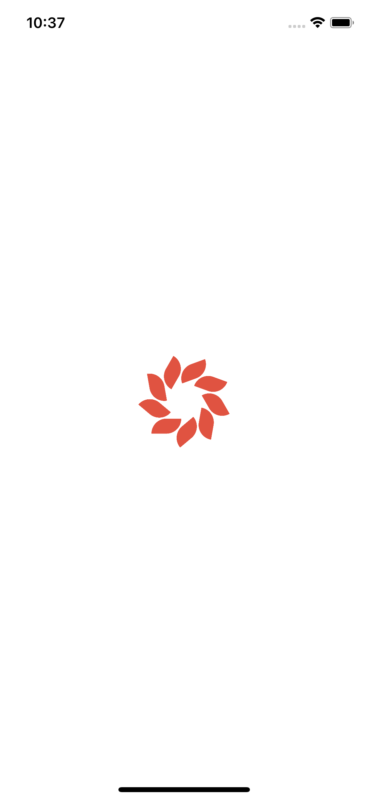
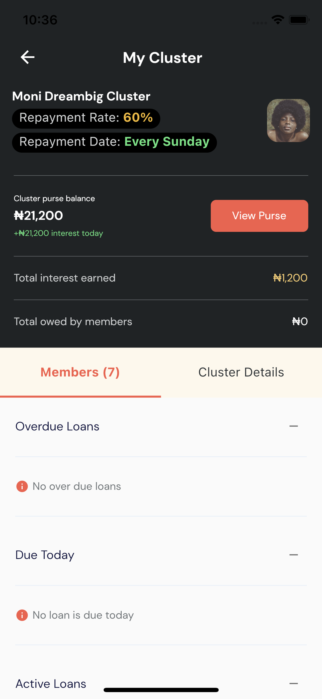
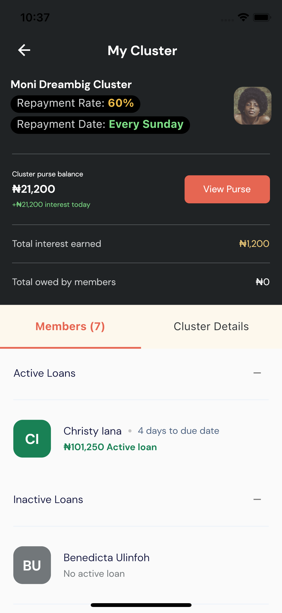
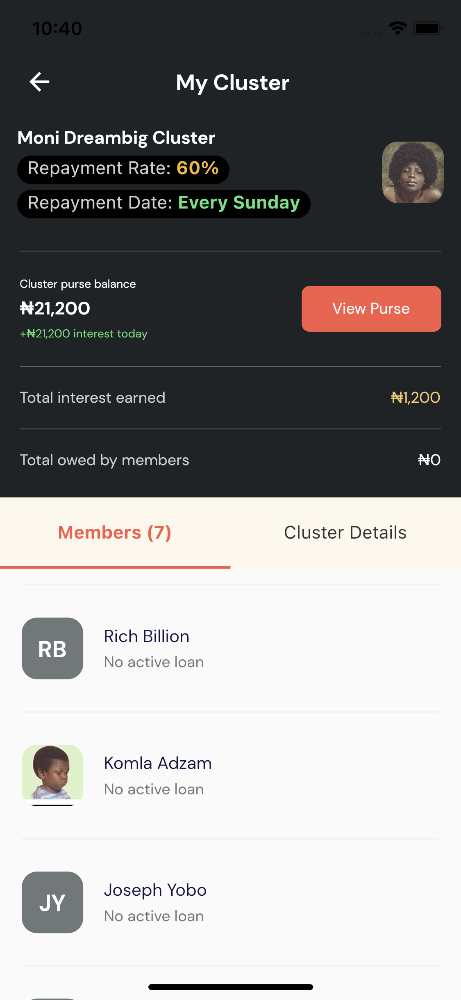
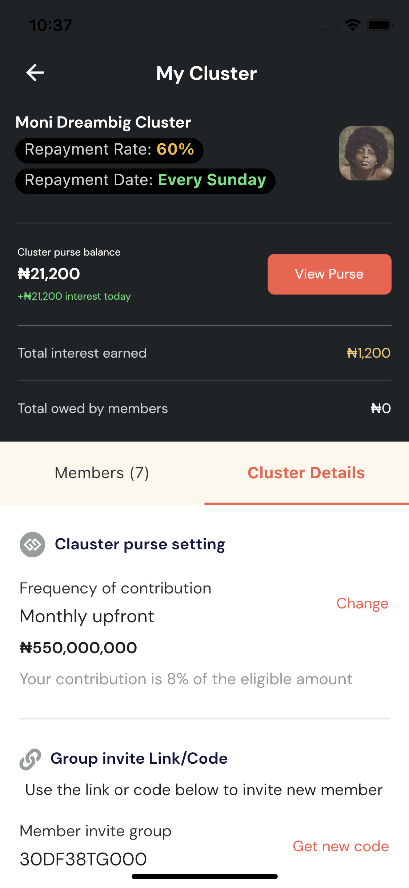

# Flutter Mobile Engineer Task - Moni

UI and API integration of the Moni task for the role of Flutter Mobile Engineer.

## Brief Description

A single page UI and API implementation of "My Cluster" screen. The page shows the details of a cluster. It has two
tabviews(members and cluster details). The "Members" tabview that shows the list of members in the clusters and their various loan status while the "Cluster Details" tabview shows details of the cluster.

Uses a full page loader with the Moni logo when an API call is active

Uses a Moni Logo as a loading and error placeholders

Agent avatar uses fullname initials as placeholders for agents without a media URL

APK file is included in the root folder(moni.apk)

## Fonts
- DMSans
- Inter

## Icon
- FontAwesome
- Material Icon

## Packages
- cupertino_icons
- http
- provider
- font_awesome_flutter
- flutter_screenutil
- flutter_svg
- intl

## Folder Structure
- moni
  - assets
    - fonts
    - images
  - lib
    - core
      - constants
      - enums
      - models
      - routes
      - services
      - utils
      - vm
    - ui
      - pages
      - shared
        - helpers
        - widget

## Screenshots

